# 1. Giriş

Bu rapor, üveit göz hastalığının tanı süreçlerinde göz hekimlerine yönelik bir karar destek sistemi geliştirmeyi hedefleyen bitirme projesi kapsamında, Faz-1 unimodal baseline modellerin geliştirilme sürecini ve elde edilen sonuçları özetlemektedir.

Projenin nihai hedefi, farklı oftalmolojik görüntüleme modalitelerinden (slit-lamp, B-scan OCT, OCTA vb.) elde edilen verileri birleştirerek multimodal bir karar destek sistemi oluşturmaktır. Ancak geliştirme sürecinde, aynı hastaya ait eşleşmiş multimodal veri bulunmadığı tespit edilmiş ve uygulama stratejisi iki faza ayrılmıştır:

- **Faz-1 (Bu rapor):** Her modalite için bağımsız çalışan unimodal uzman modeller geliştirmek
- **Faz-2 (Sonraki aşama):** Unimodal modellerin çıktılarını bir füzyon katmanında birleştirmek

Bu rapor, üç farklı modalite için geliştirilen baseline modelleri, kullanılan yöntemleri ve elde edilen sonuçları kapsamaktadır.

# 2. Proje Altyapısı

## 2.1 Proje Dizin Yapısı

Proje dosyaları aşağıdaki sistematik yapıda organize edilmiştir:

| Klasör | İçerik |
|--------|--------|
| `data_raw/` | Orijinal ham veriler (dokunulmaz arşiv) |
| `data_work/` | Temizlenmiş, eğitime hazır veri setleri |
| `metadata/` | Etiket CSV dosyaları ve train/val/test split bilgileri |
| `src/` | PyTorch Dataset sınıfları |
| `outputs/models/` | Eğitilmiş model ağırlıkları (.pth) |
| `outputs/metrics/` | Test metrikleri, confusion matrix, ROC eğrileri |
| `outputs/gradcam/` | Grad-CAM açıklanabilirlik görselleri |
| `reports/` | Proje raporları |

## 2.2 Ortak Geliştirme Pipeline'ı

Her modalite için aynı sistematik akış uygulanmıştır:

1. **Veri Temizliği:** Ham veriler incelenmiş, problemli ve duplike dosyalar çıkarılmış, temiz görüntüler `data_work/` altında `uveitis/` ve `non_uveitis/` olarak organize edilmiştir.
2. **Etiketleme:** Script ile otomatik metadata CSV üretilmiştir (image_id, filepath, sınıf bilgisi, binary_label).
3. **Train/Val/Test Split:** %70/%15/%15 oranında stratified split uygulanmıştır.
4. **Dataset Sınıfı:** PyTorch `Dataset` sınıfı yazılmış ve veri yükleme hattı doğrulanmıştır.
5. **Model Eğitimi:** Transfer learning ile pretrained backbone üzerinde fine-tuning yapılmıştır.
6. **Değerlendirme:** Test seti üzerinde metrikler, confusion matrix ve ROC eğrisi üretilmiştir.

## 2.3 Veri Dağılımı

Aşağıdaki grafik, üç modalitedeki veri miktarlarını sınıf bazında göstermektedir:

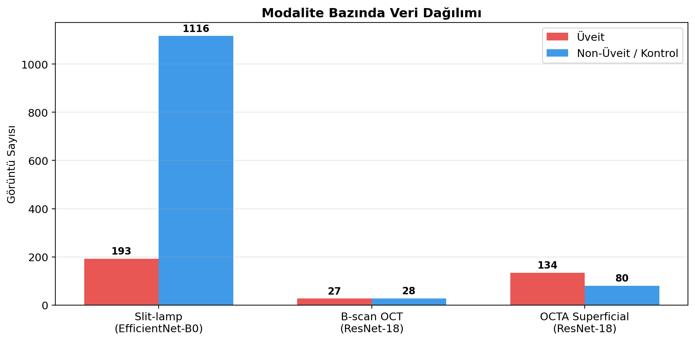

# 3. Slit-lamp Modeli (Ön Segment Fotoğrafı)

## 3.1 Veri ve Problem Tanımı

Slit-lamp modalitesinde problem **"Üveit vs Non-Üveit"** ikili sınıflandırma olarak tanımlanmıştır.

**Problem tanımına ilişkin önemli tasarım kararı:** Veri setindeki "Normal" sınıfı bilinçli olarak dışarıda bırakılmıştır. Bunun nedeni, normal sınıfındaki görüntülerin farklı veri kaynaklarından geldiği ve farklı çözünürlüklere sahip olduğunun tespit edilmesidir. Bu durum, modelin hastalık özelliklerini öğrenmek yerine veri kaynağı farkını ayırt etmesi riskini taşımaktadır. Bu nedenle negatif sınıf olarak Cataract, Conjunctivitis ve Eyelid görüntüleri kullanılmıştır. Böylece model, gerçekten oküler patolojiler arasında ayırım yapmaya zorlanmıştır.

Ayrıca orijinal veri setinde bulunan hazır augment edilmiş görüntüler ve bozuk dosyalar da veri havuzundan çıkarılmıştır.

**Sınıf dağılımı:**

| Sınıf | Görüntü Sayısı | Binary Label |
|-------|---------------|-------------|
| Uveitis | 193 | 1 (Pozitif) |
| Cataract | 549 | 0 (Negatif) |
| Conjunctivitis | 267 | 0 (Negatif) |
| Eyelid | 300 | 0 (Negatif) |
| **Toplam** | **1.309** | |

**Split detayı:** Stratified split `raw_class` bazında yapılmıştır. Bu sayede her bir alt sınıfın (Uveitis, Cataract, Conjunctivitis, Eyelid) oranı train, validation ve test setlerinde korunmuştur.

## 3.2 Model Mimarisi ve Eğitim

| Parametre | Değer |
|-----------|-------|
| Backbone | EfficientNet-B0 (ImageNet pretrained) |
| Son katman | `classifier[1] → Linear(1280, 1)` |
| Loss fonksiyonu | BCEWithLogitsLoss (pos_weight ile ağırlıklı) |
| Optimizer | AdamW |
| Öğrenme oranı | 1e-4 |
| Batch size | 16 |
| Epoch sayısı | 10 |
| Model seçim kriteri | En yüksek validation F1 skoru |

**Veri artırma (augmentation) stratejisi:**

- Eğitim seti: Resize(224×224) → RandomHorizontalFlip → RandomRotation(±10°) → ColorJitter(brightness=0.1, contrast=0.1) → ImageNet normalizasyonu
- Doğrulama/Test seti: Resize(224×224) → ImageNet normalizasyonu

**Sınıf dengesizliği yönetimi:** Eğitim setindeki pozitif ve negatif sınıf oranı hesaplanarak `pos_weight` parametresi dinamik olarak belirlenmiştir. Bu sayede azınlık sınıfındaki (Uveitis) örneklere daha yüksek kayıp ağırlığı verilmiştir.

## 3.3 Eğitim Süreci

Aşağıdaki tabloda epoch bazında eğitim metrikleri gösterilmektedir:

| Epoch | Train Loss | Val Loss | Val Acc | Val F1 | Val AUC |
|-------|-----------|----------|---------|--------|---------|
| 1 | 0.979 | 0.706 | 0.811 | 0.602 | 0.959 |
| 2 | 0.567 | 0.490 | 0.827 | 0.630 | 0.977 |
| 3 | 0.335 | 0.424 | 0.872 | 0.699 | 0.981 |
| 4 | 0.234 | 0.343 | 0.918 | 0.771 | 0.978 |
| 5 | 0.214 | 0.289 | 0.918 | 0.778 | 0.988 |
| 6 | 0.159 | 0.267 | 0.923 | 0.789 | 0.988 |
| 7 | 0.113 | 0.267 | 0.949 | 0.848 | 0.984 |
| **8** | **0.062** | **0.281** | **0.954** | **0.862** | **0.985** |
| 9 | 0.092 | 0.293 | 0.939 | 0.824 | 0.984 |
| 10 | 0.068 | 0.334 | 0.954 | 0.857 | 0.976 |

En iyi model **epoch 8'de** (Val F1 = 0.862) seçilmiştir. Train loss'un düzenli azalması ve validation metriklerinin yükselmesi, modelin sağlıklı bir öğrenme eğrisi izlediğini göstermektedir.

## 3.4 Test Sonuçları

Seçilen en iyi model, daha önce hiç görülmemiş test seti üzerinde değerlendirilmiştir:

| Metrik | Değer |
|--------|-------|
| **Accuracy** | 0.9695 (%96.95) |
| **Precision** | 0.8710 |
| **Recall** | 0.9310 |
| **F1 Score** | 0.9000 |
| **ROC AUC** | 0.9883 |

Test setinde 197 görüntü (168 Non-Üveit, 29 Üveit) üzerinden değerlendirme yapılmıştır. Model, 29 Üveit görüntüsünden 27'sini doğru tahmin ederken yalnızca 2'sini kaçırmıştır.

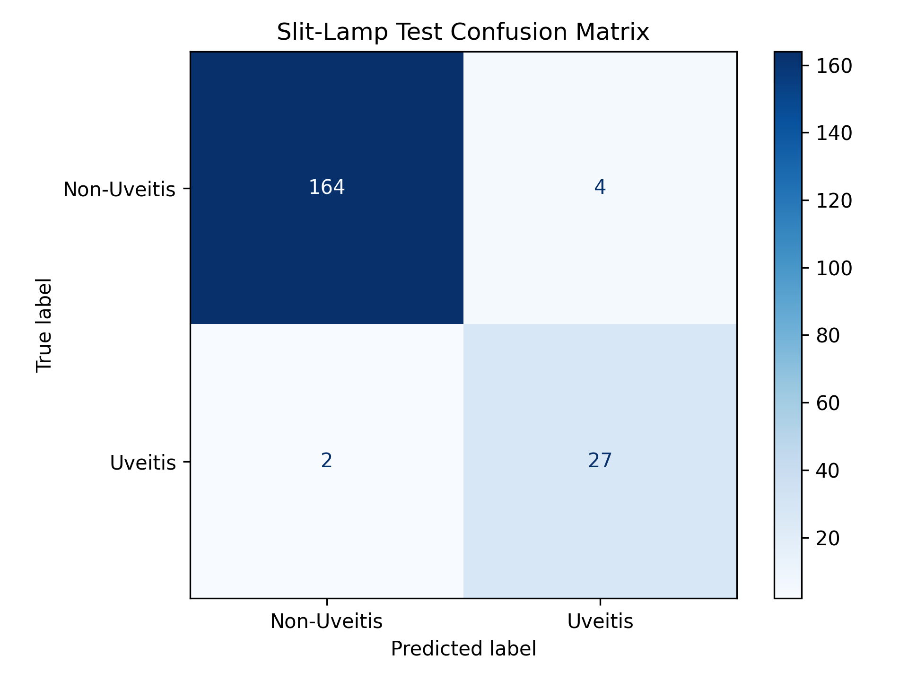

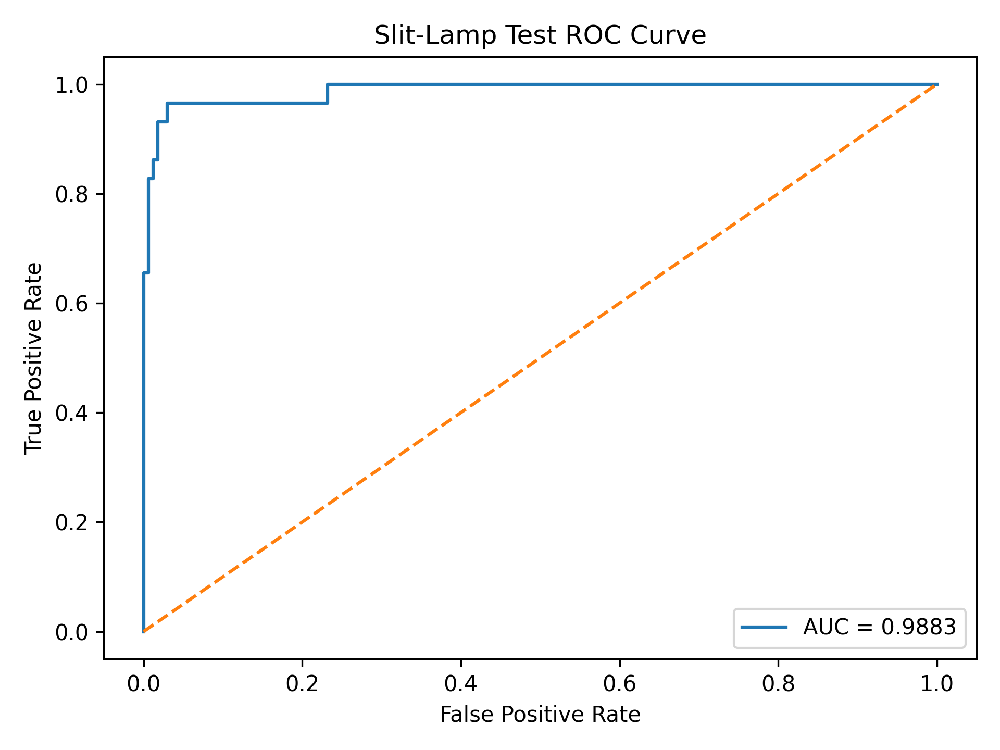

## 3.5 Açıklanabilirlik Analizi (Grad-CAM)

Modelin kararlarının klinik açıdan anlamlı olup olmadığını doğrulamak için **Gradient-weighted Class Activation Mapping (Grad-CAM)** yöntemi uygulanmıştır. Grad-CAM, modelin son konvolüsyon katmanındaki aktivasyonları kullanarak, tahmin sırasında görüntünün hangi bölgelerine odaklandığını ısı haritası olarak görselleştirmektedir.

Test setinden seçilen örnekler üzerinde üretilen Grad-CAM çıktıları aşağıda sunulmuştur. Her görselde soldan sağa: orijinal görüntü, Grad-CAM ısı haritası ve overlay (bindirme) yer almaktadır.

**True Positive Örnekleri (Doğru Üveit Tahminleri):**

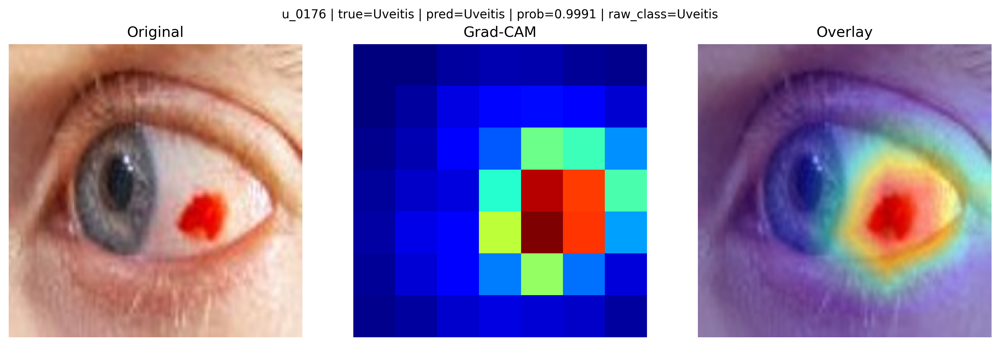

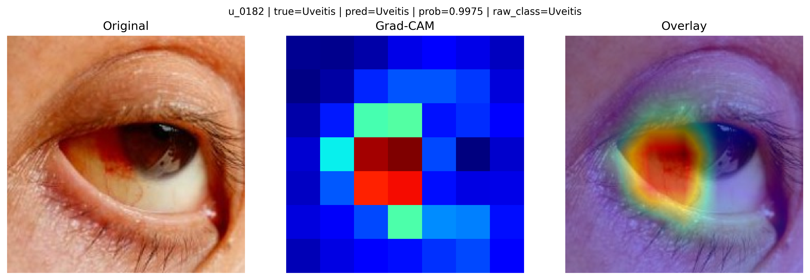

True positive örneklerde modelin, gözdeki kızarıklık ve iltihap bölgelerine odaklandığı görülmektedir. Özellikle konjonktival hiperemi (kızarıklık) ve ön kamara bölgesi modelin dikkatinin yoğunlaştığı alanlardır. Bu bulgular, klinik açıdan anlamlı bir öğrenmenin gerçekleştiğini göstermektedir.

**True Negative Örneği (Doğru Non-Üveit Tahmini):**

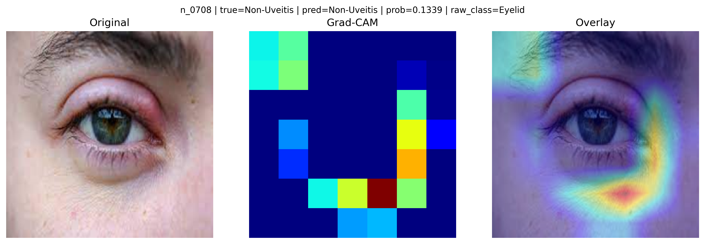

Eyelid (göz kapağı) patolojisi olan bu örnekte modelin göz kapağı bölgesine odaklandığı ve üveit olasılığını düşük (0.13) olarak tahmin ettiği görülmektedir.

**False Negative Örneği (Kaçırılan Üveit):**

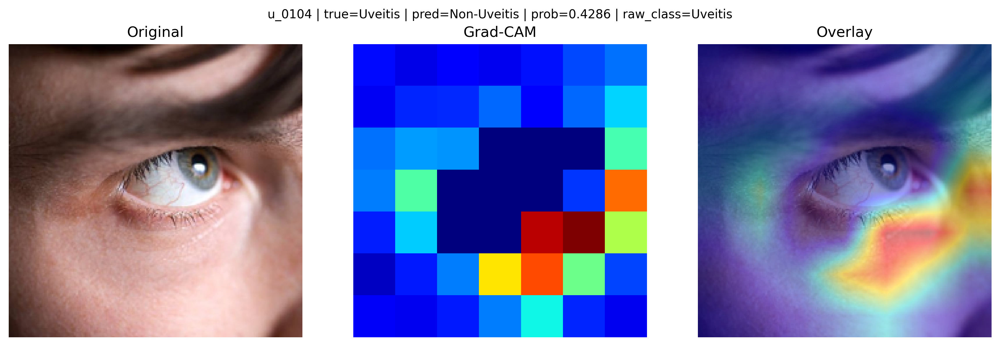

Bu örnekte model göz dışı bölgelere odaklanmış ve üveit bulgularını yakalayamamıştır. Olasılık değerinin eşik değerine yakın olması (0.43), modelin bu örnekte kararsız kaldığını göstermektedir.

# 4. OCTA Superficial Modeli

## 4.1 Veri ve Problem Tanımı

OCTA (Optik Koherens Tomografi Anjiyografi) modalitesinde, başlangıç aşamasında yalnızca **Superficial katman PNG görüntüleri** kullanılmıştır. Bu tercih, daha kontrollü bir baseline oluşturma amacıyla yapılmıştır.

Problem tanımı **"Üveit vs Kontrol"** olarak kurulmuştur:

| Sınıf | Alt Grup | Görüntü Sayısı | Binary Label |
|-------|---------|---------------|-------------|
| Üveit | Behçet Active | 73 | 1 (Pozitif) |
| Üveit | Behçet Inactive | 61 | 1 (Pozitif) |
| Kontrol | Control | 80 | 0 (Negatif) |
| **Toplam** | | **214** | |

**Data leakage önlemi:** OCTA verilerinde aynı hastanın aktif ve inaktif dönemlerde çekilmiş birden fazla görüntüsü bulunabilmektedir. Bu durumda, aynı hastanın görüntüleri farklı setlere (örneğin biri train'e, diğeri test'e) düşerse model sızıntısı (data leakage) riski oluşmaktadır. Bu riski önlemek için `group_id` mantığı kurulmuştur: `group_id = source_class + "_" + original_id`. Split işlemi görüntü bazında değil, `group_id` bazında yapılmıştır. Böylece aynı hastanın tüm görüntüleri aynı sette (train veya val veya test) yer almaktadır.

## 4.2 Model Mimarisi ve Eğitim

| Parametre | Değer |
|-----------|-------|
| Backbone | ResNet-18 (ImageNet pretrained) |
| Son katman | `fc → Linear(512, 1)` |
| Loss fonksiyonu | BCEWithLogitsLoss (pos_weight ile ağırlıklı) |
| Optimizer | AdamW |
| Öğrenme oranı | 1e-4 |
| Batch size | 16 |
| Epoch sayısı | 15 |
| Model seçim kriteri | En yüksek validation F1 skoru |

OCTA verileri slit-lamp'a kıyasla çok daha az sayıda (214 vs 1309) olduğundan, daha hafif bir mimari olan ResNet-18 tercih edilmiştir. Augmentation stratejisi slit-lamp modeli ile aynıdır.

## 4.3 Eğitim Süreci

| Epoch | Train Loss | Val Loss | Val Acc | Val F1 | Val AUC |
|-------|-----------|----------|---------|--------|---------|
| 1 | 0.532 | 0.546 | 0.406 | 0.095 | 0.546 |
| 3 | 0.365 | 0.449 | 0.688 | 0.750 | 0.737 |
| 7 | 0.086 | 0.441 | 0.750 | 0.800 | 0.846 |
| 10 | 0.064 | 0.392 | 0.813 | 0.833 | 0.850 |
| **12** | **0.068** | **0.401** | **0.844** | **0.865** | **0.879** |
| 15 | 0.047 | 0.421 | 0.813 | 0.833 | 0.896 |

En iyi model **epoch 12'de** (Val F1 = 0.865) seçilmiştir. Model başlangıçta çok yavaş öğrenmiş (epoch 1'de F1=0.095) ancak epoch 7'den itibaren anlamlı performansa ulaşmıştır.

## 4.4 Test Sonuçları

| Metrik | Değer |
|--------|-------|
| **Accuracy** | 0.6970 (%69.70) |
| **Precision** | 0.7895 |
| **Recall** | 0.7143 |
| **F1 Score** | 0.7500 |
| **ROC AUC** | 0.7817 |

Test setinde 33 görüntü (12 Control, 21 Uveitis) üzerinden değerlendirme yapılmıştır. Doğrulama setine kıyasla test performansında kayda değer bir düşüş gözlenmiştir (Val F1: 0.865 → Test F1: 0.750). Bu durum, küçük veri setlerindeki varyansın yüksek olmasıyla açıklanabilir.

# 5. B-scan OCT Modeli

## 5.1 Veri ve Problem Tanımı

B-scan OCT modalitesinde problem **"Üveit vs Normal"** ikili sınıflandırma olarak tanımlanmıştır. Pozitif sınıf, intermediate/posterior uveitis ve panuveitis alt tiplerinden oluşmaktadır.

| Sınıf | Görüntü Sayısı | Binary Label |
|-------|---------------|-------------|
| Üveit (intermediate/posterior + panuveitis) | 27 | 1 (Pozitif) |
| Normal | 28 | 0 (Negatif) |
| **Toplam** | **55** | |

**Veri kısıtı:** Bu modalite, 55 görüntü ile en küçük veri setine sahip olan modalitedir. Düşük veri miktarı, modelin genelleme kapasitesini ciddi şekilde sınırlamaktadır.

## 5.2 Model Mimarisi ve Eğitim

| Parametre | Değer |
|-----------|-------|
| Backbone | ResNet-18 (ImageNet pretrained) |
| Son katman | `fc → Linear(512, 1)` |
| Loss fonksiyonu | BCEWithLogitsLoss (pos_weight ile ağırlıklı) |
| Optimizer | AdamW |
| Öğrenme oranı | 1e-4 |
| Batch size | 16 |
| Epoch sayısı | 15 |
| Model seçim kriteri | En yüksek validation F1 skoru |

## 5.3 Eğitim Süreci ve Overfitting Gözlemi

| Epoch | Train Loss | Val Loss | Val F1 | Val AUC |
|-------|-----------|----------|--------|---------|
| 1 | 0.612 | 0.773 | 0.000 | 0.813 |
| 3 | 0.136 | 0.685 | 0.667 | 0.875 |
| **4** | **0.074** | **0.632** | **0.857** | **0.875** |
| 9 | 0.004 | 0.650 | 0.857 | 0.875 |
| 12 | 0.054 | 0.917 | 0.750 | 0.813 |
| 15 | 0.273 | 1.164 | 0.750 | 0.813 |

Eğitim sürecinde belirgin bir **overfitting** gözlemlenmiştir: train loss epoch 9'da 0.004'e (neredeyse sıfır) düşerken, validation loss ilk birkaç epochtan sonra sürekli artmıştır (0.63 → 1.16). Bu durum, 55 görüntülük veri setinin model eğitimi için yetersiz olmasından kaynaklanmaktadır. Validation setinde yalnızca 8 görüntü bulunduğundan, metrikler yüksek varyansa sahiptir.

## 5.4 Test Sonuçları

| Metrik | Değer |
|--------|-------|
| **Accuracy** | 1.0000 (%100) |
| **Precision** | 1.0000 |
| **Recall** | 1.0000 |
| **F1 Score** | 1.0000 |
| **ROC AUC** | 1.0000 |

Test setinde 9 görüntü üzerinden tüm metrikler 1.0 olarak hesaplanmıştır. Ancak bu sonuç, test setinin son derece küçük olmasından kaynaklanan bir yüksek varyans durumudur ve modelin genellenebilirliği hakkında güvenilir bir çıkarım yapmaya yetmemektedir. Eğitim eğrilerindeki overfitting bulgusu ve küçük test seti boyutu göz önünde bulundurulduğunda, bu mükemmel sonuçlar ihtiyatlı yorumlanmalıdır.

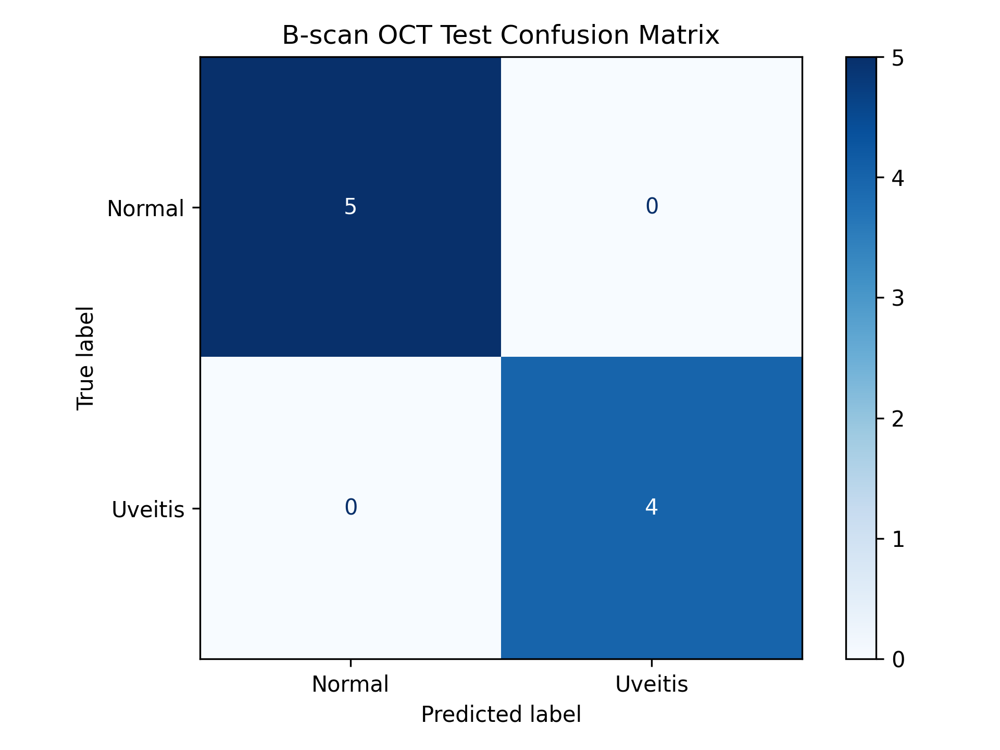

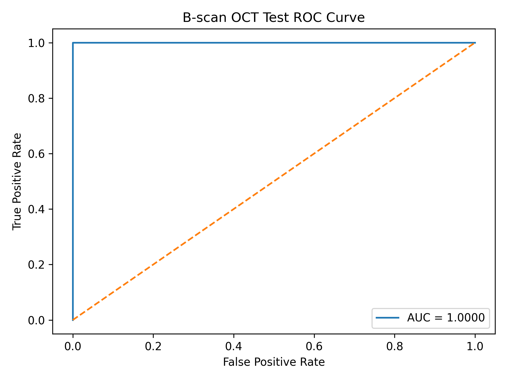

# 6. Karşılaştırmalı Değerlendirme

## 6.1 Eğitim Kayıp Eğrileri

Aşağıdaki şekilde üç modelin eğitim (train) ve doğrulama (validation) kayıp eğrileri karşılaştırmalı olarak gösterilmektedir:

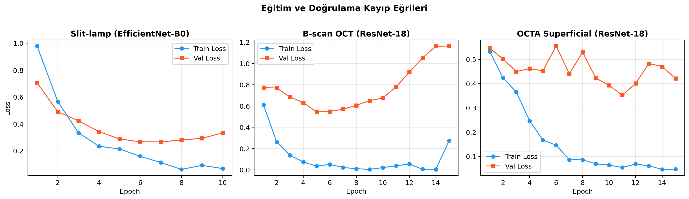

Slit-lamp modelinde train ve validation loss eğrilerinin birbirine yakın seyretmesi, sağlıklı bir öğrenme sürecini göstermektedir. B-scan OCT modelinde train-validation loss arasında açılan makas overfitting'in net göstergesidir. OCTA modelinde ise validation loss'un dalgalı seyri, küçük validation seti boyutundan kaynaklanan yüksek varyansı yansıtmaktadır.

## 6.2 Test Performansları

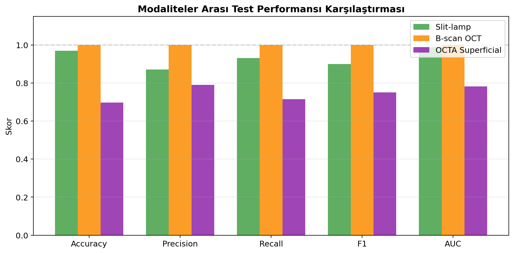

| Metrik | Slit-lamp | OCTA Superficial | B-scan OCT |
|--------|-----------|-----------------|------------|
| Accuracy | 0.9695 | 0.6970 | 1.0000* |
| Precision | 0.8710 | 0.7895 | 1.0000* |
| Recall | 0.9310 | 0.7143 | 1.0000* |
| F1 | 0.9000 | 0.7500 | 1.0000* |
| AUC | 0.9883 | 0.7817 | 1.0000* |
| Veri sayısı | 1.309 | 214 | 55 |
| Test seti | 197 | 33 | 9 |
| Güvenilirlik | ✓ Yüksek | Orta | Düşük |

*\* B-scan OCT sonuçları, 9 görüntülük çok küçük test seti nedeniyle yüksek varyansa sahiptir.*

## 6.3 Genel Değerlendirme

- **Slit-lamp modeli** en güvenilir ve en başarılı baseline modeldir. Yeterli veri miktarı, sağlıklı eğitim eğrisi ve klinik olarak anlamlı Grad-CAM çıktılarıyla birlikte tamamlanmış bir unimodal uzman model haline gelmiştir.
- **OCTA modeli**, sınırlı veri miktarına rağmen çalışan ikinci uzman model olarak kurulmuştur. Data leakage önlemi gibi metodolojik kararlar doğru bir şekilde uygulanmıştır; ancak test performansı iyileştirmeye açıktır.
- **B-scan OCT modeli**, mevcut veri miktarı ile güvenilir sonuçlar üretememektedir. Bu modalite için ek veri temini veya daha güçlü veri artırma teknikleri gerekecektir.

# 7. Kullanılan Yöntemler Özeti

| Yöntem | Açıklama |
|--------|----------|
| Transfer Learning | ImageNet üzerinde önceden eğitilmiş modellerin son katmanları değiştirilerek fine-tuning yapılmıştır |
| EfficientNet-B0 | Slit-lamp modeli için backbone mimari |
| ResNet-18 | B-scan OCT ve OCTA modelleri için backbone mimari |
| BCEWithLogitsLoss | İkili sınıflandırma için kayıp fonksiyonu; pos_weight ile sınıf dengesizliği yönetimi |
| AdamW | Ağırlık düzenlileştirmesi (weight decay) içeren adaptif optimizer |
| Stratified Split | Sınıf dağılımını koruyarak %70/%15/%15 oranında veri bölme |
| Group-based Split | OCTA'da data leakage önlemi için hasta bazlı grup bölme |
| Data Augmentation | RandomHorizontalFlip, RandomRotation, ColorJitter |
| Grad-CAM | Açıklanabilirlik analizi için sınıf aktivasyon haritası yöntemi |
| Early Stopping (manual) | Validation F1 skoruna göre en iyi modelin seçilmesi |

# 8. Sonuç ve Sonraki Adımlar

Faz-1 kapsamında üç farklı oftalmolojik görüntüleme modalitesi için unimodal baseline modeller başarıyla geliştirilmiştir. Her modalite için sistematik bir veri hazırlama, eğitim ve değerlendirme süreci uygulanmıştır. Slit-lamp modeli güçlü bir baseline performans sergilemiş; OCTA ve B-scan OCT modelleri ise veri kısıtlarına rağmen çalışır duruma getirilmiştir.

**Sonraki adımlar arasında şunlar değerlendirilebilir:**

- Model mimarilerinde ve hiperparametrelerde iyileştirmeler
- Veri artırma stratejilerinin güçlendirilmesi
- Ek veri temini (özellikle B-scan OCT için)
- OCTA için diğer katman görüntülerinin (Deep, Full) denenmesi
- Grad-CAM analizinin OCTA ve B-scan OCT modelleri için de genişletilmesi
- Faz-2 multimodal füzyon mimarisinin tasarlanması
